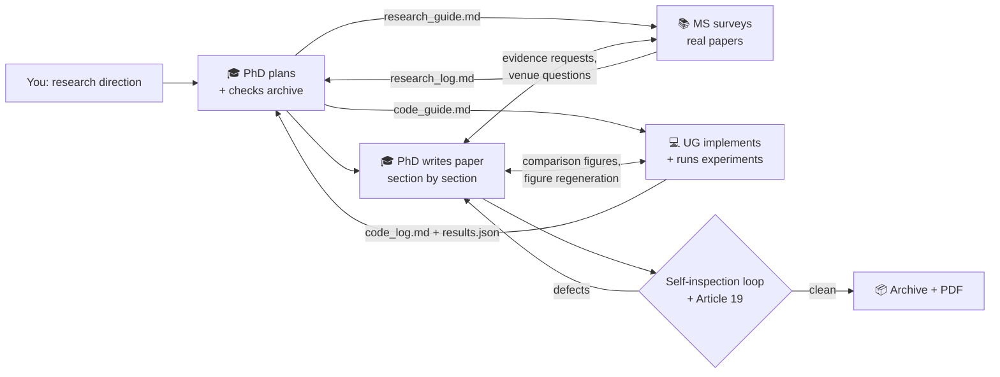
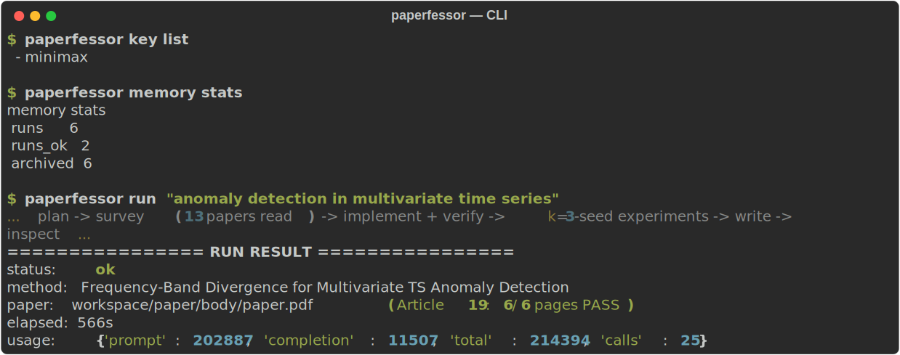
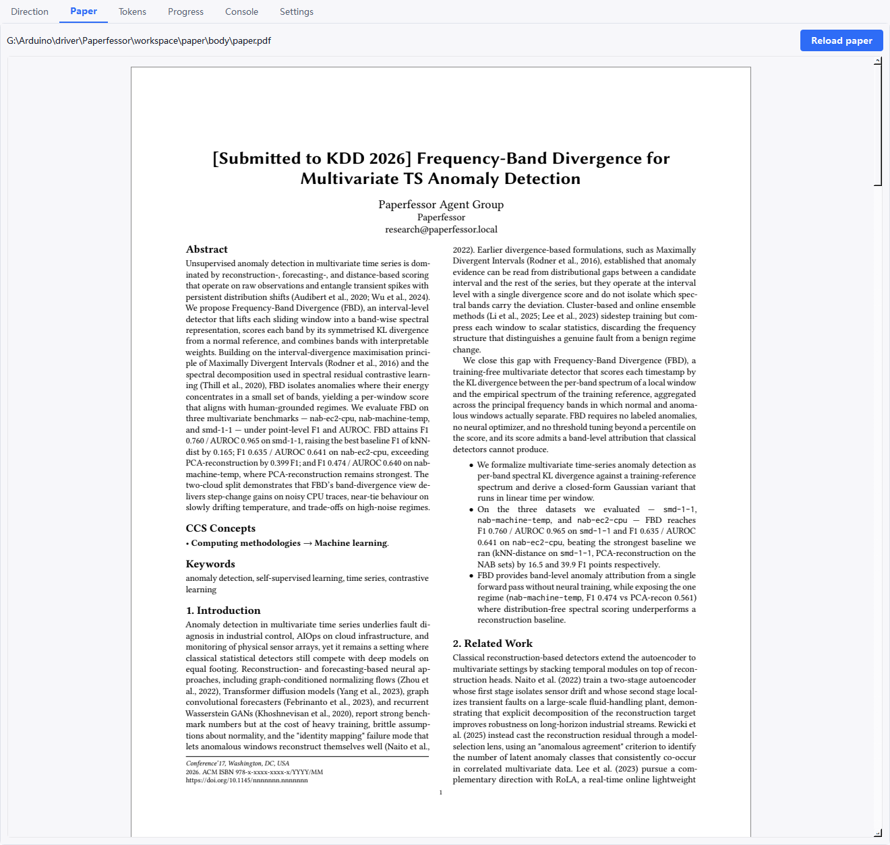

<div align="center">


# Paperfessor

### A research direction goes in. A survey, real experiments, and a venue-formatted paper come out.

*Supervised by Prof. Meerk — a meerkat who never stops watching over your research.*

[](https://pypi.org/project/paperfessor/)
[](LICENSE)
[](pyproject.toml)
[](#installation)
[](#responsible-use-and-disclaimer)

**English** · [简体中文](docs/zh-CN/README.md) · [日本語](docs/ja/README.md) · [Español](docs/es/README.md) · [Français](docs/fr/README.md) · [Deutsch](docs/de/README.md) · [Italiano](docs/it/README.md) · [Português](docs/pt/README.md) · [Русский](docs/ru/README.md) · [한국어](docs/ko/README.md) · [العربية](docs/ar/README.md)


*Inside Prof. Meerk's studio — curious minds + shared knowledge + relentless iteration = real impact.*

</div>

---

## Why Paperfessor?

Most "AI paper writers" hallucinate citations and numbers. **Paperfessor doesn't** —
it is built so a paper is *earned*, not *invented*:

- 📊 **Real experiments, real numbers** — it downloads real public datasets, runs
  the proposed method and baselines itself (k = 3 seeds, mean ± 95% CI), and puts
  the *measured* results in the paper. No fabricated metrics, no "TBD" cells.
- 📚 **Real citations** — every reference is resolved against arXiv / OpenAlex /
  Semantic Scholar; unverifiable citations are removed.
- 🔍 **Self-inspecting** — the PhD agent re-reads the whole paper against the
  measured results, fixes defects, and re-checks the rendered layout, page by
  page, until it is clean.
- 🔒 **Private by design** — your API key lives in the OS keychain; no local paths,
  filenames, or machine info ever reach the paper.
- 🖥️ **Runs on your machine, your key** — cloud LLMs or local Ollama / llama.cpp.

> **A recent end-to-end run** on *"anomaly detection in multivariate time series"*
> produced a 10-page KDD-formatted PDF where the proposed method won best-F1 on
> 2 of 3 datasets (e.g. **F1 0.703, AUROC 0.946** on SMD vs the strongest baseline
> at 0.595) — every number traceable to `results.json`, all 10 pages passing the
> layout inspector, and the one dataset it lost on stated plainly.

---

Paperfessor is a three-agent research assistant. Give it a research direction —
one sentence is enough — and its agent group works the way a small lab does:

| Agent | Role | Status API |
|---|---|---|
| 🎓 **PhD student** | Invents the method, dispatches tasks, supervises, writes and inspects the paper | `planning / dispatching / monitoring / reviewing / writing / archiving` |
| 📚 **Master's student** | Broad literature search (arXiv + OpenAlex + Scholar), rigorous full-text reading, evidence extraction, venue-requirements investigation | `websearch / reading / analyzing / reporting / idle / stopped` |
| 💻 **Undergraduate** | Implements the method against a strict contract, downloads and preprocesses real datasets, runs k-seed experiments | `coding / thinking / reporting / idle / stopped` |

Every number in the paper is **measured, never fabricated**: datasets are real
public downloads (loaders refuse synthetic stand-ins), the proposed method is
verified by actually running it, and each rendered page passes an automated
layout inspection before the run is accepted.

## How it works



The PhD reviews the workers **passively** (on every report) and **actively**
(any worker silent for 2 minutes gets checked). All coordination flows through
plain-Markdown guides and logs in `workspace/` — you can watch the lab work in
real time with nothing more than a text editor.

## 60-second quickstart

```bash
# 1. Install (Python 3.11+; add [gui] for the desktop app)
pip install paperfessor

# 2. Store your LLM key (kept in the OS keychain, never on disk)
paperfessor key set minimax --key "sk-..."   # or openai / anthropic / google

# 3. Write a paper
paperfessor run "anomaly detection in multivariate time series"
```

That's it — the three agents plan, survey, code, experiment, write, and
self-inspect, then drop a venue-formatted PDF in `workspace/paper/body/`.

## Installation

```bash
pip install paperfessor              # core
pip install "paperfessor[gui]"       # + desktop GUI (PyQt6)
pip install "paperfessor[gui,web]"   # + Playwright browsing for full-text
```

From a clone (for development): `pip install -e ".[gui,web,dev]"`.

**LaTeX** (TeX Live / MiKTeX / MacTeX with the `acmart` class) is recommended
for PDF output; without it Paperfessor falls back to `.docx` (pandoc) or
Markdown. Works on **Windows, macOS, and Linux**.

## First-time setup

API keys live in the **OS keychain** (Windows Credential Manager / macOS
Keychain / Secret Service) — never on disk, never in logs, never in the paper.

```bash
paperfessor key set minimax --key "sk-..."   # or openai / anthropic / google
paperfessor key test minimax                 # keychain + LLM round-trip
paperfessor models list                      # discover live models
```

Local models work too: point the provider at `ollama` or `llamacpp` and no
key is needed.

## Run a paper

```bash
paperfessor run "anomaly detection in multivariate time series"
```

What you get in `workspace/`:

```text
paper/body/paper.pdf      # venue-formatted PDF (acmart two-column)
paper/body/paper.md       # canonical Markdown source
src/results/results.json  # measured metrics (k = 3 seeds, mean ± 95% CI)
src/figures/              # results chart, dataset sample, block diagram
shared/*.md               # the agents' guides and work logs
archived/<slug>/<run id>/ # permanent record of the attempt
```

The CLI in action (real output from a completed run):

<div align="center">

</div>

Prefer a window? `paperfessor-gui` launches the desktop app with the same
pipeline, live agent status, token usage, and a built-in paper preview:

<div align="center">

</div>

## Configuration

Everything is settable via `.env` (prefix `PAPERFESSOR_`) or the GUI Settings
tab. The essentials:

| Variable | Default | Meaning |
|---|---|---|
| `PAPERFESSOR_PROVIDER` | `minimax` | LLM provider slug |
| `PAPERFESSOR_MODEL` | `MiniMax-M3` | Project-wide default model |
| `PAPERFESSOR_PHD_MODEL` / `MS_MODEL` / `UG_MODEL` | `MiniMax-M3` | Per-agent overrides |
| `PAPERFESSOR_THINKING_MODE` | `true` | Extended-reasoning prefill |
| `PAPERFESSOR_MAX_INPUT_TOKENS` | `1000000` | Input cap per call |
| `PAPERFESSOR_LANGUAGE` | `en` | Interface language `en / zh-CN / ja` |

Full list in [`.env.example`](.env.example). Per-agent model picking:
`paperfessor models pick --group phd`.

## CLI reference

```bash
paperfessor run [DIRECTION] [--venue ... --depth ... --provider ... --model ...]
paperfessor key {set,list,delete,test}      # keychain-backed key management
paperfessor models {list,pick}              # live model discovery
paperfessor memory {stats,runs,archived}    # long-term run memory (SQLite)
paperfessor config show | paperfessor doctor
paperfessor-gui                             # desktop app
```

## Good to know

- **Honesty by construction.** If the survey is thin, the model fails
  verification, or a dataset cannot be downloaded, the run is marked *failed*
  and archived as such — the paper never papers over a gap with invented
  numbers or "TBD" cells.
- **Everything is inspectable.** The PhD's private memos
  (`doc_memo.md`, `article_memo.md`), both work logs, and the archive record
  every decision with timestamps.
- **Datasets ship with licenses.** Each downloaded dataset records its source
  URL, license, SHA-256, and split manifest; respect the upstream licenses
  (e.g. NAB is AGPL-3.0).
- **Cost control.** One end-to-end run is roughly 200–250K input tokens with
  MiniMax-M3. Use per-agent model overrides to put a cheaper model on the UG.
- **Only registered benchmark domains get experiments.** Currently:
  time-series anomaly detection (SMD, NAB). Other domains produce a paper
  with the experiment section honestly marked pending — extend
  `paperfessor/research/datasets.py` to add your domain.

## Responsible use and disclaimer

Paperfessor is built **for research purposes only** — as a study of
multi-agent scientific workflows and an assistant for early-stage drafts.

- **Do not** submit its output to conferences, journals, or classes as your
  own unassisted work, and never in violation of the venue's AI-assistance,
  authorship, or plagiarism policies. Disclose AI assistance where required.
- **Verify everything.** Generated text, citations, code, and numbers must be
  checked by a human before any real-world use.
- **Do not** use it for fabricated research, citation manipulation, paper
  mills, or any illegal or deceptive purpose.

**The authors and contributors of this repository accept no responsibility or
liability for any misuse of this software or for any consequences arising
from its use.** Use of Paperfessor implies acceptance of these terms and of
the [MIT license](LICENSE)'s no-warranty clause.

## License

[MIT](LICENSE) — free for research and commercial use, no warranty.
The Prof. Meerk mascot (`assets/Prof_Meerk.png`) is part of this
repository's branding.
