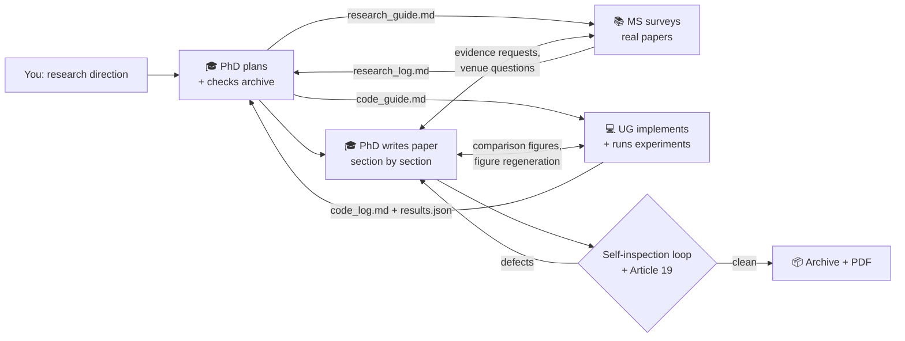

<div align="center">


# Paperfessor

### A research direction goes in. A survey, real experiments, and a venue-formatted paper come out.

*Supervised by Prof. Meerk — a meerkat who never stops watching over your research.*

[](https://pypi.org/project/paperfessor/)
[](https://github.com/dunknowcoding/Paperfessor/actions/workflows/workflow.yml)
[](LICENSE)
[](pyproject.toml)
[](#installation)
[](#responsible-use-and-disclaimer)

**English** · [简体中文](docs/zh-CN/README.md) · [日本語](docs/ja/README.md) · [Español](docs/es/README.md) · [Français](docs/fr/README.md) · [Deutsch](docs/de/README.md) · [Italiano](docs/it/README.md) · [Português](docs/pt/README.md) · [Русский](docs/ru/README.md) · [한국어](docs/ko/README.md) · [العربية](docs/ar/README.md)


*Inside Prof. Meerk's studio — curious minds + shared knowledge + relentless iteration = real impact.*

</div>

---

## Why Paperfessor?

Most "AI paper writers" hallucinate citations and numbers. Paperfessor is
built with **guardrails that make that hard** — a paper should be *earned*,
not *invented*:

- 📊 **Experiments produce the numbers** — it downloads real public datasets, runs
  the proposed method and baselines itself (k = 3 seeds, mean ± 95% CI), and the
  table is filled from the *measured* `results.json`, not from the language model.
- 📚 **Citations are resolved against real indexes** — arXiv / OpenAlex /
  Semantic Scholar; citations that can't be verified are removed.
- 🔍 **Self-inspecting** — the PhD agent re-reads the whole paper against the
  measured results, flags defects (unmeasured numbers, missing references,
  layout problems), fixes them, and re-checks page by page until clean.
- 🔒 **Private by design** — your API key lives in the OS keychain; a redaction
  pass strips local paths, filenames, and machine info from the paper.
- 🖥️ **Runs on your machine, your key** — cloud LLMs or local Ollama / llama.cpp.

> **A note on honesty.** These guardrails constrain the machinery around the
> model — real data, verified citations, a measured results table, layout gates.
> They **cannot guarantee** the prose an LLM writes is accurate or free of
> subtle errors; that depends on the model you plug in, and no wrapper can make
> a language model truthful. **Always review the generated paper before any
> real use** — treat Paperfessor as a fast, well-supervised first-draft
> assistant, not an oracle.

> **A recent end-to-end run** on *"anomaly detection in multivariate time series"*
> produced a 10-page KDD-formatted PDF where the proposed method won best-F1 on
> 2 of 3 datasets (e.g. **F1 0.703, AUROC 0.946** on SMD vs the strongest baseline
> at 0.595) — every number traceable to `results.json`, all 10 pages passing the
> layout inspector, and the one dataset it lost on stated plainly.

---

Paperfessor is a three-agent research assistant. Give it a research direction —
one sentence is enough — and its agent group works the way a small lab does:

| Agent | Role | Status API |
|---|---|---|
| 🎓 **PhD student** | Invents the method, dispatches tasks, supervises, writes and inspects the paper | `planning / dispatching / monitoring / reviewing / writing / archiving` |
| 📚 **Master's student** | Broad literature search (arXiv + OpenAlex + Scholar), rigorous full-text reading, evidence extraction, venue-requirements investigation | `websearch / reading / analyzing / reporting / idle / stopped` |
| 💻 **Undergraduate** | Implements the method against a strict contract, downloads and preprocesses real datasets, runs k-seed experiments | `coding / thinking / reporting / idle / stopped` |

Numbers in the results table come from a **measured** `results.json`, not from
the language model: datasets are real public downloads (loaders refuse synthetic
stand-ins), the proposed method is verified by actually running it, and each
rendered page passes an automated layout inspection before the run is accepted.
The surrounding prose is still written by an LLM — see the honesty note above and
**verify it yourself**.

## How it works



The PhD reviews the workers **passively** (on every report) and **actively**
(any worker silent for 2 minutes gets checked). All coordination flows through
plain-Markdown guides and logs in `workspace/` — you can watch the lab work in
real time with nothing more than a text editor.

## 60-second quickstart

```bash
# 1. Install (Python 3.11+; add [gui] for the desktop app)
pip install paperfessor

# 2. Store your LLM key (kept in the OS keychain, never on disk)
paperfessor key set minimax --key "sk-..."   # or openai / anthropic / google

# 3. Write a paper
paperfessor run "anomaly detection in multivariate time series"
```

That's it — the three agents plan, survey, code, experiment, write, and
self-inspect, then drop a venue-formatted PDF in `workspace/paper/body/`.

## System requirements

| Component | Requirement | Needed for |
|---|---|---|
| **Python** | 3.11 or 3.12 | **Required** — the whole tool |
| **An LLM key or local model** | one provider (MiniMax / OpenAI / Anthropic / Google) **or** local Ollama / llama.cpp | **Required** — the agents call an LLM |
| **~1–2 GB disk + network** | for dataset/paper downloads | **Required** at run time |
| **LaTeX** | TeX Live / MiKTeX / MacTeX with `acmart` | *Recommended* — real PDF; without it, `.docx`/Markdown fallback |
| **Pandoc** | any recent version | *Optional* — enables the `.docx` fallback when LaTeX is absent |
| **PyQt6** | `paperfessor[gui]` | *Optional* — the desktop GUI |
| **Playwright** | `paperfessor[web]` + `playwright install` | *Optional* — browser-driven full-text retrieval |
| **GPU (CUDA) + PyTorch** | any | *Optional* — only used for heavy or speed-topic experiments; everything runs on CPU by default |

Works on **Windows, macOS, and Linux**.

## Installation

```bash
pip install paperfessor              # core
pip install "paperfessor[gui]"       # + desktop GUI (PyQt6)
pip install "paperfessor[gui,web]"   # + Playwright browsing for full-text
```

From a clone (for development): `pip install -e ".[gui,web,dev]"`, or
`pip install -r requirements.txt` for just the core runtime.

> ⚠️ **Version drift.** `pip install paperfessor` and
> `pip install -r requirements.txt` install into the **active** environment and
> may **upgrade or downgrade** packages you already have (`litellm`, `numpy`,
> `matplotlib`, and `pydantic` pull large dependency trees). Install into a
> **fresh virtualenv or conda env** to avoid disturbing other projects:
> `python -m venv .venv && . .venv/bin/activate` (or
> `conda create -n paperfessor python=3.11`), then install.

**LaTeX** (TeX Live / MiKTeX / MacTeX with the `acmart` class) is recommended
for PDF output; without it Paperfessor falls back to `.docx` (pandoc) or
Markdown. Works on **Windows, macOS, and Linux**.

## First-time setup

API keys live in the **OS keychain** (Windows Credential Manager / macOS
Keychain / Secret Service) — never on disk, never in logs, never in the paper.

```bash
paperfessor key set minimax --key "sk-..."   # or openai / anthropic / google
paperfessor key test minimax                 # keychain + LLM round-trip
paperfessor models list                      # discover live models
```

Local models work too: point the provider at `ollama` or `llamacpp` and no
key is needed.

## Run a paper

```bash
paperfessor run "anomaly detection in multivariate time series"
```

What you get in `workspace/`:

```text
paper/body/paper.pdf      # venue-formatted PDF (acmart two-column)
paper/body/paper.md       # canonical Markdown source
src/results/results.json  # measured metrics (k = 3 seeds, mean ± 95% CI)
src/figures/              # results chart, dataset sample, block diagram
shared/*.md               # the agents' guides and work logs
archived/<slug>/<run id>/ # permanent record of the attempt
```

The CLI in action (real output from a completed run):

<div align="center">

</div>

Prefer a window? `paperfessor-gui` launches the desktop app with the same
pipeline, live agent status, token usage, and a built-in paper preview:

<div align="center">

</div>

## Configuration

Everything is settable via `.env` (prefix `PAPERFESSOR_`), CLI flags on
`paperfessor run`, or the GUI **Settings** tab — you have full control over each
agent's model, reasoning, and permissions.

**Models & reasoning**

| Variable | Default | Meaning |
|---|---|---|
| `PAPERFESSOR_PROVIDER` | `minimax` | LLM provider slug (`minimax`/`openai`/`anthropic`/`google`/`ollama`/`llamacpp`) |
| `PAPERFESSOR_MODEL` | `MiniMax-M3` | Project-wide default model |
| `PAPERFESSOR_PHD_MODEL` / `MS_MODEL` / `UG_MODEL` | `MiniMax-M3` | Per-agent model overrides |
| `PAPERFESSOR_THINKING_MODE` | `true` | Extended-reasoning prefill |
| `PAPERFESSOR_MAX_INPUT_TOKENS` | `1000000` | Input cap per call (lower for local models with small context) |
| `PAPERFESSOR_LANGUAGE` | `en` | Interface language `en / zh-CN / ja` |

**Coordination budgets** (bound every agent loop; raise for quality, lower for cost)

| Variable | Default | Meaning |
|---|---|---|
| `PAPERFESSOR_MAX_METHOD_ROUNDS` | `3` | Improvement rounds before a method is abandoned |
| `PAPERFESSOR_MAX_UG_ROUNDS` | `5` | UG implement→verify→fix attempts |
| `PAPERFESSOR_MAX_INSPECTION_ROUNDS` | `3` | Whole-paper self-inspection cycles |
| `PAPERFESSOR_MAX_LLM_CALLS` | `85` | Hard per-run LLM-call budget |

**UG permissions** (see the safety section below)

| Variable | Default | Meaning |
|---|---|---|
| `PAPERFESSOR_UG_ALLOW_LOCAL_TOOLS` | `true` | UG may run local CLI tools (MATLAB/R/office/etc.) |
| `PAPERFESSOR_UG_ALLOW_INSTALLS` | `true` | UG may `pip install` packages |
| `PAPERFESSOR_UG_ALLOW_GPU` | `true` | UG may use CUDA for heavy/speed-topic experiments |

Full list in [`.env.example`](.env.example). Per-agent model picking:
`paperfessor models pick --group phd`.

## Permissions, safety, and workspace layout

Paperfessor runs real code and can touch your machine. Two protection layers:

**⚠️ Default permissions are permissive.** Out of the box the Undergraduate
agent **can install software and run local tools** (`ug_allow_installs` and
`ug_allow_local_tools` default to `true`) so experiments "just work." If you do
not want that, turn it off before running:

```bash
# Lock the UG down: no installs, no external tools, no GPU
PAPERFESSOR_UG_ALLOW_INSTALLS=false \
PAPERFESSOR_UG_ALLOW_LOCAL_TOOLS=false \
PAPERFESSOR_UG_ALLOW_GPU=false \
paperfessor run "your direction"
```

or set them in `.env` / the GUI Settings tab. Every install is logged to
`workspace/src/tools/installed.txt` and every tool call to
`workspace/shared/code_log.md` for audit. Note that **LLM-generated *model*
code always runs in a strict sandbox** — no network, no file I/O, no shell —
regardless of these settings; the permissions above govern only the UG agent's
own toolbelt.

**Hard folder scope.** Each agent may only create, modify, download, or install
inside its assigned folders — enforced in code, not just prompted:

| Agent | May write to | Never touches |
|---|---|---|
| 🎓 **PhD** | `workspace/paper/`, `workspace/archived/`, `workspace/doc_memo.md`, `workspace/article_memo.md`, `workspace/shared/*_guide.md` | source code, datasets, the work logs |
| 📚 **Master's** | `workspace/shared/research_log.md`, downloaded papers under `workspace/src/papers/` | everything else |
| 💻 **Undergraduate** | `workspace/src/` only — `code/`, `tmp/` (scratch), `datasets/` (downloads), `tools/` (installs), `results/`, `figures/` — and `workspace/shared/code_log.md` | anything outside `workspace/src/` (path-guarded; escapes are refused) |

Nothing is written outside `workspace/`. Downloads land in
`workspace/src/datasets/`, installed tools are recorded in
`workspace/src/tools/`, temporary scripts go to `workspace/src/tmp/` (cleared
each run), and only files the PhD explicitly copies into `workspace/paper/`
reach the paper.

## CLI reference

```bash
paperfessor run [DIRECTION] [--venue ... --depth ... --provider ... --model ...]
paperfessor key {set,list,delete,test}      # keychain-backed key management
paperfessor models {list,pick}              # live model discovery
paperfessor memory {stats,runs,archived}    # long-term run memory (SQLite)
paperfessor config show | paperfessor doctor
paperfessor-gui                             # desktop app
```

## Research goals and the SOTA campaign

By default Paperfessor **pursues state-of-the-art**: the proposed method must
beat the baselines, or the run is marked *failed* and the next attempt tries a
different method. Tell it otherwise when your paper isn't chasing a win:

```bash
paperfessor run "..." --goal comparison    # fair benchmark; no win required
paperfessor run "..." --goal experiments   # empirical study; report what happens
paperfessor run "..." --goal review        # literature review / survey
paperfessor run "..." --goal exploration   # open-ended; findings as-is
# --goal sota (default): iterate until competitive
```

A single `paperfessor run` is **one method attempt**. To let the PhD pursue the
goal across many attempts — improve the same method (UG model changes,
hyperparameter tuning, minor theory edits) up to `--max-method-rounds` times,
then abandon it and design a different one, and when all planned methods are
exhausted start a **fresh planning phase that keeps memory but clears the
article, experiments, and datasets** — run a **campaign**:

```bash
paperfessor run "..." --campaign --max-campaign-attempts 6
```

Retry depth is yours to set: `--max-method-rounds` accepts **1 to effectively
unbounded** (default 3). In non-SOTA goals a campaign stops at the first clean,
honestly-reported paper.

> ⚠️ **Optional packages may be auto-installed.** Some topics need libraries
> beyond the core (e.g. `torch`, `opencv-python`, `pandas`, `scipy`,
> `networkx`). With the default UG install permission, the agent installs any
> it needs *during* generation into the active environment (logged to
> `workspace/src/tools/installed.txt`). Use a dedicated venv/conda env, or set
> `PAPERFESSOR_UG_ALLOW_INSTALLS=false` to forbid it.

## Good to know

- **Honesty guardrails (not a guarantee).** If the survey is thin, the model
  fails verification, or a dataset cannot be downloaded, the run is marked
  *failed* and archived as such, and the results table is filled only from
  measured data. These checks make fabrication *hard*, but the LLM's prose can
  still contain mistakes — the guardrails reduce risk, they do not remove the
  need to review.
- **Everything is inspectable.** The PhD's private memos
  (`doc_memo.md`, `article_memo.md`), both work logs, and the archive record
  every decision with timestamps.
- **Datasets ship with licenses.** Each downloaded dataset records its source
  URL, license, SHA-256, and split manifest; respect the upstream licenses
  (e.g. NAB is AGPL-3.0).
- **Cost control.** One end-to-end run is roughly 200–250K input tokens with
  MiniMax-M3. Use per-agent model overrides to put a cheaper model on the UG.
- **Only registered benchmark domains get experiments.** Currently:
  time-series anomaly detection (SMD, NAB). Other domains produce a paper
  with the experiment section honestly marked pending — extend
  `paperfessor/research/datasets.py` to add your domain.

## Responsible use and disclaimer

Paperfessor is built **for research purposes only** — as a study of
multi-agent scientific workflows and an assistant for early-stage drafts.

- **Do not** submit its output to conferences, journals, or classes as your
  own unassisted work, and never in violation of the venue's AI-assistance,
  authorship, or plagiarism policies. Disclose AI assistance where required.
- **Verify everything.** Generated text, citations, code, and numbers must be
  checked by a human before any real-world use.
- **Do not** use it for fabricated research, citation manipulation, paper
  mills, or any illegal or deceptive purpose.

**The authors and contributors of this repository accept no responsibility or
liability for any misuse of this software or for any consequences arising
from its use.** Use of Paperfessor implies acceptance of these terms and of
the [MIT license](LICENSE)'s no-warranty clause.

## License

[MIT](LICENSE) — free for research and commercial use, no warranty.
The Prof. Meerk mascot (`assets/Prof_Meerk.png`) is part of this
repository's branding.
